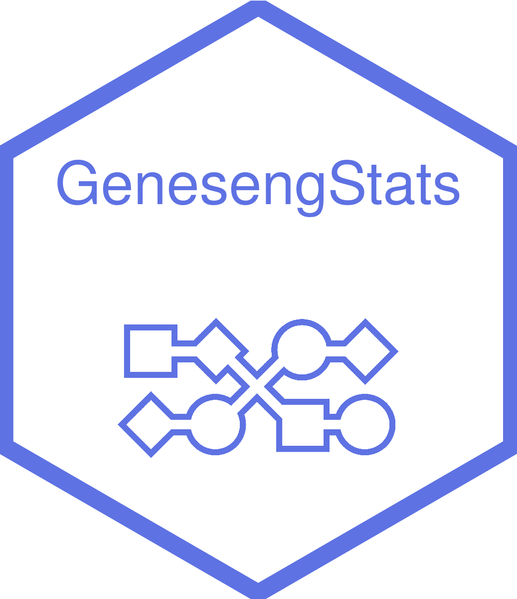

<!-- README.md is generated from README.Rmd. Please edit that file -->

```{r, include = FALSE}
knitr::opts_chunk$set(
  collapse = TRUE,
  comment = "#>",
  fig.path = "man/figures/README-",
  out.width = "100%"
)
```

# genesengStats <a href=#></a>

> Basic statistical methods to make preliminary analysis

`genesengStats` is a dependency of Geneseng app used to quickly describe tabular datasets.


## Installation

The latest version can be installed from GitHub as follows:

``` {r eval = FALSE}
install.packages("devtools")
devtools::install_github("geneseng/genesengStats")
```


## Example

``` {r}
suppressWarnings({
  genesengStats::geneseng_summary_stats(data = iris, group = "Species")[[1]]
})
```

